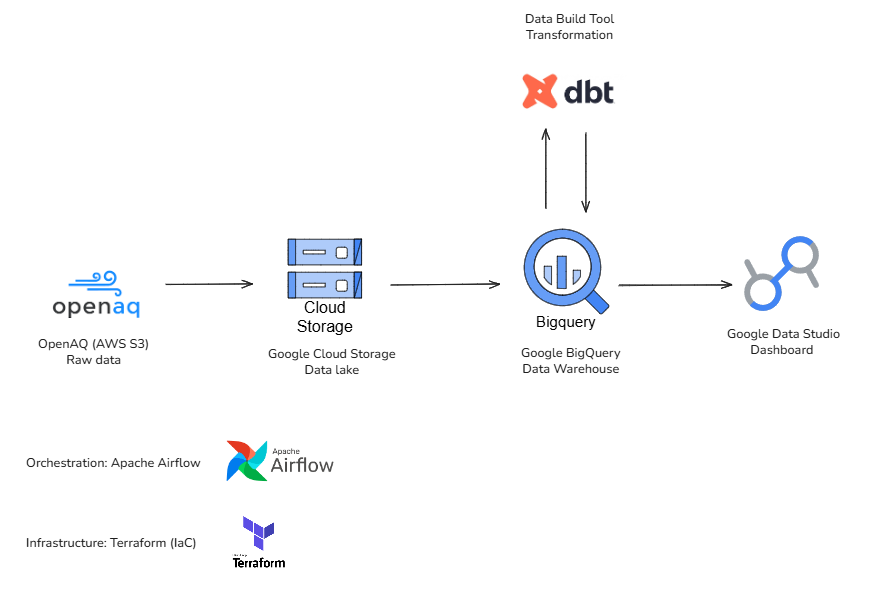
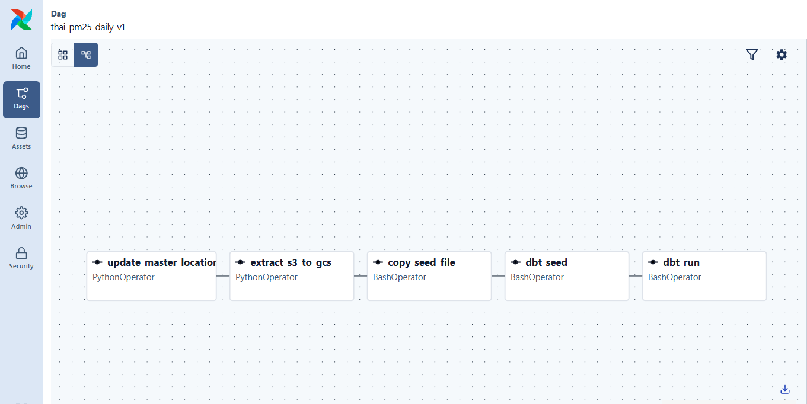
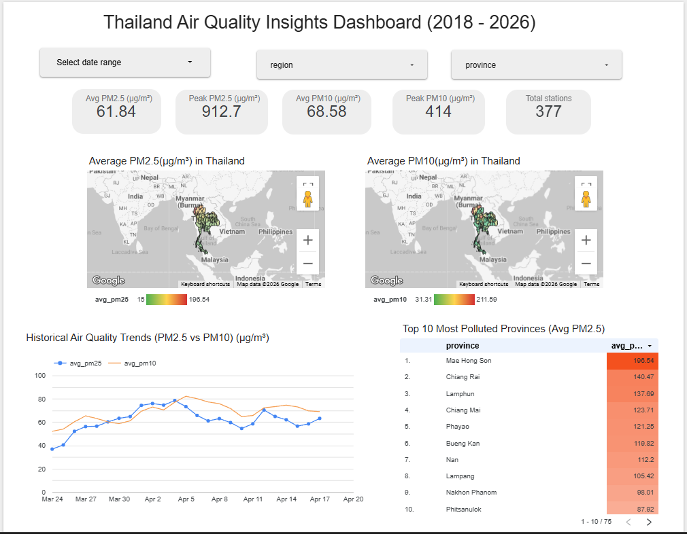

# Thailand PM2.5 Data Pipeline

> **DataTalks.Club's Data Engineering Zoomcamp Project**

## Project Overview

Air pollution, specifically PM2.5, is one of the most pressing health and environmental issues in Thailand. This project builds an **end-to-end automated data pipeline** covering air quality data from **2018 to present** that:

1. **Extracts** historical and daily incremental air quality data from the public [OpenAQ AWS S3 Registry](https://registry.opendata.aws/openaq/)
2. **Loads** raw data into a **Google Cloud Storage** data lake
3. **Transforms** the data using **dbt** into analytics-ready tables in **BigQuery**
4. **Visualizes** insights on a **Data Studio** dashboard

## Architecture



## Technologies

| Layer | Technology |
|---|---|
| Cloud | Google Cloud Platform (GCS, BigQuery) |
| Infrastructure as Code | Terraform |
| Orchestration | Apache Airflow (Dockerized) |
| Transformation | dbt with `dbt-bigquery` adapter |
| Language | Python 3.12+ (managed by `uv`) |
| Dashboard | Google Data Studio |

---
## Project Structure

```
thai-pm25-data-pipeline/
├── dags/                          # Airflow DAG definitions
│   └── thai_pm25_daily_pipeline.py
├── scripts/                       # Airflow task scripts
│   ├── daily_extract_s3_to_gcs.py
│   └── refresh_master_locations.py
├── dbt_thai_pm25/                 # dbt project
│   ├── models/
│   │   ├── staging/               # stg_pm 
│   │   └── marts/                 # dim_thai_locations, fct_pm_daily
│   ├── seeds/                     # thai_locations.csv
│   ├── dbt_project.yml
│   └── profiles.yml
├── terraform/                     # Infrastructure as Code
│   ├── main.tf
│   └── variables.tf
├── data/                          # Local data files
│   └── thai_locations.csv
├── init_master_locations.py       # One-time: fetch station master data
├── extract_openaq_s3_to_data_lake.py  # One-time: historical backfill
├── docker-compose.yaml            # Airflow cluster configuration
├── .env                           # Environment variables (gitignored)
└── pyproject.toml                 # Python dependencies (managed by uv)
```
---

## Reproducibility Guide

Follow these steps to completely rebuild this pipeline from scratch.

### Prerequisites

| Tool | Installation |
|---|---|
| Google Cloud Platform account | https://cloud.google.com/ |
| Docker & Docker Compose | https://docs.docker.com/get-docker/ |
| Terraform | https://developer.hashicorp.com/terraform/downloads |
| `uv` (Python package manager) | https://docs.astral.sh/uv/ |
| OpenAQ API Key | https://openaq.org/ (sign up for free) |

---

### Step 1: GCP Setup & Service Account

1. Create a new GCP project (e.g. `my-pm25-project`)
2. Create a **Service Account** with the following roles:
   - `BigQuery Admin`
   - `Storage Admin`
3. Generate and download the JSON key file
4. Place the key file at:
   ```
   terraform/keys/credentials.json
   ```
   > **CRITICAL**: This file is gitignored. Never commit or share this file.

---

### Step 2: Infrastructure as Code (Terraform)

Terraform provisions the GCS bucket and BigQuery datasets automatically.

1. Create a `terraform/terraform.tfvars` file with your project values:
   ```hcl
   project         = "your-gcp-project-id"
   region          = "your-region"
   location        = "your-location"
   gcs_bucket_name = "your-unique-gcs-bucket-name"
   bq_dataset      = "your_staging_dataset"
   bq_dataset_prod = "your_prod_dataset"
   ```

2. Run Terraform:
   ```bash
   cd terraform
   terraform init
   terraform plan
   terraform apply
   cd ..
   ```

---

### Step 3: Environment Variables

Create a `.env` file in the project root:

```env
<!-- AIRFLOW_UID=To get your `AIRFLOW_UID` on Linux/WSL, run: `echo -e "AIRFLOW_UID=$(id -u)" >> .env -->

OPENAQ_API_KEY=your_openaq_api_key

# GCP & Data Pipeline Configuration
GCP_PROJECT_ID=your-gcp-project-id
GCP_GCS_BUCKET=your-unique-gcs-bucket-name
DBT_DATASET_DEV=your_staging_dataset

# dbt Schema/Dataset Configuration
DBT_STAGING_SCHEMA=your_staging_dataset
DBT_PROD_SCHEMA=your_prod_dataset

# Historical Load Configuration
START_YEAR=2018
END_YEAR=2026
MAX_WORKERS=25

# Airflow DAG Configuration
AIRFLOW_DAG_OWNER=your-name
```

> To get your `AIRFLOW_UID` on Linux/WSL, run: `echo -e "AIRFLOW_UID=$(id -u)" >> .env`

---

### Step 4: Initial Historical Load (One-time, Local)

This phase seeds the master data and loads historical location data into GCS.

#### 4.1 Install Python dependencies
```bash
uv sync
```

#### 4.2 Generate master station list
Fetches all Thai monitoring stations from OpenAQ API, performs reverse geocoding to map coordinates to Thai provinces, and saves the result to `data/thai_locations.csv`.
```bash
uv run python init_master_locations.py
```

#### 4.3 Backfill historical data to GCS
Transfers raw CSV.GZ files from the public OpenAQ S3 bucket to your GCS data lake (2018–2026). This is idempotent — files already in GCS are skipped.
```bash
uv run python extract_openaq_s3_to_data_lake.py
```

#### 4.4 Create BigQuery External Table
In the **BigQuery Console** (SQL Editor), run this query to create an external table pointing to your GCS data. Replace the project ID, dataset, and bucket name with your own values:

```sql
CREATE OR REPLACE EXTERNAL TABLE `<YOUR_PROJECT_ID>.<YOUR_STAGING_DATASET>.openaq_raw_external`
OPTIONS (
  format = 'CSV',
  uris = ['gs://<YOUR_GCS_BUCKET>/openaq_data/*'],
  compression = 'GZIP',
  ignore_unknown_values = true
);
```

#### 4.5 Run dbt (Initial Full Refresh)
```bash
cd dbt_thai_pm25
uv run dbt deps --profiles-dir .
uv run --env-file ../.env dbt seed --profiles-dir .
uv run --env-file ../.env dbt run --full-refresh --profiles-dir .
uv run --env-file ../.env dbt test --profiles-dir .
cd ..
```

> 💡 `dbt deps` downloads `dbt_utils` package (used for surrogate key generation).
> `--full-refresh` drops and rebuilds the incremental fact table from scratch.

---

### Step 5: Daily Batch Pipeline (Airflow + Docker)

Once the initial load is complete, switch to the automated daily pipeline.

#### 5.1 Start Airflow
```bash
docker compose build
docker compose up -d
```
Wait 1–2 minutes for services to become healthy, then verify:
```bash
docker ps
```

#### 5.2 Configure Airflow Connection
1. Open the Airflow UI at **http://localhost:8080** (login: `airflow` / `airflow`)
2. Go to **Admin → Connections**
3. Create a new connection:
   - **Connection Id**: `google_cloud_default`
   - **Connection Type**: `Google Cloud`
   - **Project Id**: your GCP project ID
   - **Keyfile Path**: `/opt/airflow/terraform/keys/credentials.json`

#### 5.3 Enable the DAG
1. In the Airflow UI, find the DAG: **`thai_pm25_daily_v1`**
2. Toggle the switch to **ON** (unpause)

The DAG runs daily at **02:00 UTC** and executes these tasks in order:

| Task | Description |
|---|---|
| `update_master_locations` | Syncs new stations from OpenAQ API |
| `extract_s3_to_gcs` | Extracts the day's data from S3 → GCS |
| `copy_seed_file` | Copies updated CSV to dbt seeds |
| `dbt_seed` | Refreshes dimension table in BigQuery |
| `dbt_run` | Incrementally updates the fact table |


---

## Dashboard

[Link to Live Data Studio Dashboard](https://datastudio.google.com/reporting/7e10d328-e766-4853-ad98-3e9e820f136b)

*Thailand Air Quality Insights & Heatmap*



